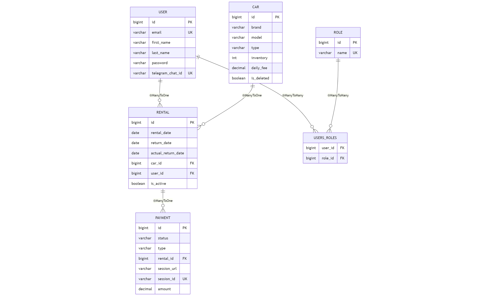
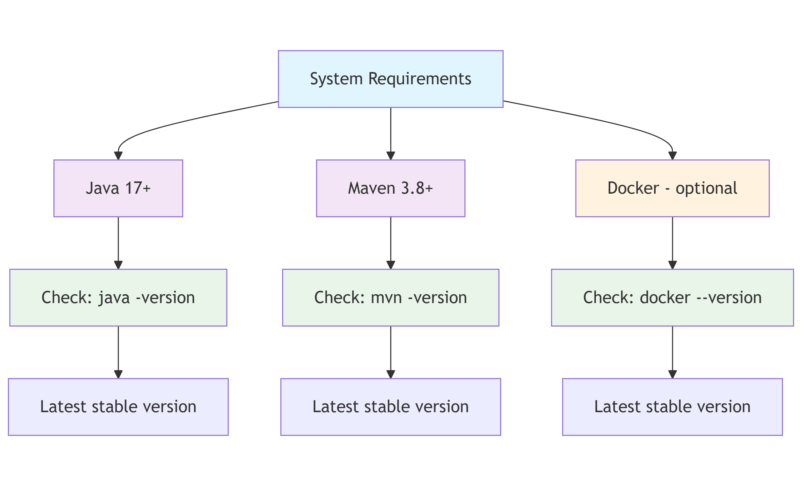

## **Project "CAR SHARING App"**

   Welcome to the *scalable and modular RESTful API** — **CarSharing  Backend**.  
This project is built using modern technologies such as **Java**, **Spring Boot**, **Spring Security**, **Spring Data JPA**, **Swagger**, **Docker**, and more.

### **The purpose of the project**

   The purpose of this application is to provide full functionality of the online car rental service to users, namely:
- to manage users and authentication;
- to manage and view cars, their characteristics and quantity;
- to accompany, control and manage the signed lease by users;
- to monitor and track rent payments using the Stripe payment system;
- to inform customers with the help of a chatbot about the lease and the payments made.

  The project includes **robust security mechanisms**, **role-based access control** and **interactive API documentation** via Swagger.

---

### **Technologies & Tools Used**

**Core Technologies:**
- ***Java 17*** – main programming language used for backend development;

- ***Spring Boot 3.5.0*** – framework for rapid development with built-in server and production-ready configurations;

- ***Spring Security + JWT (JJWT 0.12.3)*** – user authentication and authorization via JSON Web Tokens;

- ***Spring Data JPA (Hibernate)*** – ORM layer for database interaction using repositories;

- ***Liquibase 4.21.1*** – database versioning and schema migration tool;

- ***MapStruct 1.5.5.Final*** – code generator for efficient mapping between DTOs and entities;

- ***Lombok 1.18.30*** – reduces boilerplate code with annotations like @Getter, @Builder, etc.;

- ***Stripe Java SDK 29.1.0*** – integration with Stripe payment platform;

- ***Telegram Bots Spring Boot Starter 6.9.0*** – sending messages to Telegram via Spring Boot;

- ***Swagger / OpenAPI (Springdoc 2.8.9)*** – automatically generates interactive API documentation;

**Database & Persistence:**
- ***MySQL 9.3.0*** – primary relational database used for persistent storage;

- ***H2 2.3.232*** – lightweight in-memory database used for testing;

**Testing:**
- ***JUnit 5*** – framework for writing unit and integration tests;

- ***Spring Test (MockMvc)***– testing web layers without starting a full HTTP server;

- ***Testcontainers 1.18.0*** –run integration tests using real databases in Docker containers;

- ***WireMock 3.13.1*** – mocking external HTTP APIs during tests;

**Build & Code Quality:**
- ***Maven*** – build tool and dependency management system;

- ***Checkstyle (plugin 3.3.0)*** – static code analysis to enforce coding standards via checkstyle.xml;

**Containerization:**
- ***Docker & Docker Compose*** – containerization tools for consistent deployment across environments;

**Development Tools:**
- ***IntelliJ IDEA*** – primary integrated development environment (IDE);

- ***Git & GitHub*** – version control and source code hosting;

- ***Postman*** – manual testing and exploration of RESTful APIs;

- ***Docker Desktop*** – local environment for managing containers.

---

### **Project structure**

  This project is an application with a multi-level architecture:
- model layer - defines domain entities and data transfer objects (DTOs);
- repository layer - interacts with the database using Spring Data JPA;
- service layer - characterized by the presence of business logic, and is also an intermediary between repositories and controllers;
- controller layer - controller Layer: Exposes RESTful endpoints and handles HTTP requests/responses.


### **The scheme of relationships in the database**:


---

### **Main Features and Functionalities**

The system is implemented on the basis of RESTful architecture and includes the following key controllers:

### **'AuthenticationController':**
- **POST: `/registration`** - register a new user (automatically assigned the USER role);
- **POST: `/login`** - authenticate an existing user and generate a JWT token.

### **'UserController':**
- **GET: `/users/me`** - viewing the information of user;
- **PUT: `/users/me`** - updating the imformation of user;
- **PATCH: `/users/me`** - updating the password of user;
- **PUT: `/users/{id}/role`** - updating the role of user;
- **GET: `/users/all`** - viewing all users.

### **'CarController':**
- **POST: `/cars`** - creating a new car;
- **GET: `/cars/{id}`** - viewing all information by car id;
- **PUT: `/cars/{id}`** - changing any parameter in the car;
- **GET: `/cars`** - viewing the list of all cars information;
- **PATCH: `/cars/{id}`** - updating a car invention by id;
- **DELETE: `/cars/{id}`** - deleting the car by id.

### **'RentalController':**
- **POST: `/rentals`** - creating a rental;
- **GET: `/rentals/{rentalId}`** - viewing the rental by id;
- **GET: `/rentals/active`** - viewing all active rentals;
- **POST: `/rentals/{rentalId}/return`** - closing the rental by id.

### **'PaymentController':**
- **POST: `/payments/create`** - creating a session to payment rental;
- **GET: `/payments/{id}`** - viewing the payment by id;
- **GET: `/payments/success/{sessionId}`** - stripe redirects here after successful payment;
- **GET: `/payments/cancel/{sessionId}`** - stripe redirects here after cancelled payment;
- **GET: `/payments`** - the ability to review all payments by the manager, and by the сustomer - his own;

---

### **How to start working with the project**

Do you want to quickly run a Spring Boot application locally? Here is a step-by-step guide.

### 1. Check the necessary tools.

 - ***before starting, make sure you have the following components installed:***



 - ***register and get keys or tokens in the following systems:***
 
   - TelegramBot;
   - Stripe.

### 2. Generate a Spring Boot app skeleton with the necessary dependencies using the official starter project generator
### Spring Initializr. To open the new project in IntelliJ IDEA.

### 3. To create the project from GitHub (create a new repository [go to the page]: https://github.com/skucherenko7/car-sharing-app

### 4.Register the project in IntelliJ IDEA with a link to the remote repository, thus linking them.

### 5. Environment settings.

In the root folder, create an .env file with the following content:
```
JWT_EXPIRATION=your_data
JWT_SECRET=your_data
STRIPE_SECRET_KEY=your_data
PAYMENT_SUCCESS_URL=your_data
PAYMENT_CANCEL_URL=your_data
TELEGRAM_BOT_TOKEN=your_data
MYSQLDB_USER=your_data
MYSQL_ROOT_PASSWORD=your_data
MYSQL_DATABASE=your_data
MYSQL_LOCAL_PORT=your_data
MYSQL_DOCKER_PORT=your_data
SPRING_LOCAL_PORT=your_data
SPRING_DOCKER_PORT=your_data
DEBUG_PORT=your_data
```

### 6. Launching the application using Maven or Docker:

**Run the Application Using Maven**
- Use the following command to launch the Spring Boot application:
```
mvn spring-boot:run
```
**Verify the Application is Running**
- If successful, you will see logs ending with something like:
```
Started CarSharingApplication in X.XXX seconds (process running for X.XXX)
```

**Or using Docker to run app**

- Run the app with Docker Compose
```
docker compose up --build
```

Now that Spring Boot application is running, you can use Postman (or any other REST client) to test its API endpoints.

---

### All Postman collections

[Postman collections](CarSharingApp.postman_collection.json)

---

### To learn how to use endpoints in Swagger, watch this video:

[▶️ Watch the demo video](https://www.loom.com/share/e139c04a5e7640a089a280a523bfe67e?sid=d68c14f1-b81a-4741-933c-ffe0b7da8639)

---

### You can also test this API yourself using Swagger by accessing the following link:

[Link to Swagger: CarSharing] (http://ec2-13-60-37-102.eu-north-1.compute.amazonaws.com)
